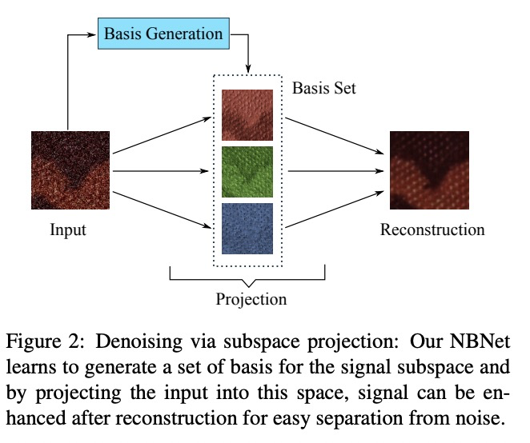

# NBNet: Noise Basis Learning for Image Denoising with Subspace Projection 

Code for CVPR21 paper [NBNet](https://arxiv.org/abs/2012.15028).

<u>*The illustration of our key insight:*</u>



## Dependencies

- MegEngine >= 1.3.1 (For DistributedDataParallel)


## Training

### Preparation

```
python prepare_data.py --data_dir yours_sidd_data_path
```


### Begin training:

For SIDD benchmark,  use:

```
python train_mge.py -d prepared_data_path -n num_gpus
```


For DnD benchmark,  we use MixUp additionally:

```
python train_mge.py -d prepared_data_path -n num_gpus --dnd
```

### Begin testing:
Download the pretrained checkpoint and use:

```
python test.py -d prepared_data_path -c checkpoint_path
```
The result is **PSNR 39.765**.


## Pretrained model

MegEngine checkpoint for SIDD benchmark can be downloaded via 
[Google Drive](https://drive.google.com/file/d/1RPAf9ZJqqq9ePPVTtJRlixX4-h3HJTCc/view?usp=sharing)
or
[GitHub Release](https://github.com/megvii-research/NBNet/releases).
